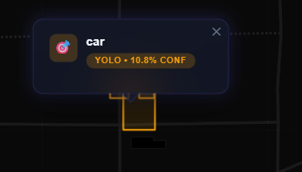

# WebGIS Fasilitas

Aplikasi WebGIS fullstack untuk memetakan fasilitas umum. Terdiri dari antarmuka React (frontend) dan API FastAPI dengan integrasi PostGIS (backend). Aplikasi ini dikembangkan sebagai pemenuhan **Tugas Praktikum 8 - SIG**.

  

## 🌟 Fitur Utama
* **Frontend Interaktif (React & Leaflet):** Menampilkan peta *fullscreen* menggunakan CartoDB Dark Matter.
* **Integrasi Data GeoJSON:** Memuat titik data fasilitas secara langsung (real-time) melalui fetch API FastAPI.
* **Popup Informasi Cerdas:** Menampilkan nama, jenis, dan alamat fasilitas saat penanda (marker) diklik.
* **Kategorisasi Warna:** Setiap kategori/jenis fasilitas memiliki pewarnaan markernya masing-masing secara dinamis (Custom SVG & style warna).
* **Interaksi Hover & Animasi:** Efek *scale up*, *glow*, serta transisi *glassmorphism* di berbagai elemen UI seperti Legend (Legenda Peta).
* **Fly To Location:** Animasi pemusatan ke titik koordinat saat sebuah marker diklik.
* **Pipeline deteksi objek citra aerial/satelit (YOLOv8):** Citra besar diproses dengan *tiling*, hasil bounding box diubah ke koordinat geografis (GeoTIFF georeferensi atau bbox WGS84 manual untuk JPG/PNG), diekspor sebagai GeoJSON, dan ditampilkan sebagai poligon di peta yang sama.

## Persyaratan teknis (deteksi)

Ringkasan fitur yang diimplementasikan sesuai spesifikasi tugas:

1. Model deteksi **YOLOv8** (bawaan `yolov8n.pt`, dapat diganti model fine-tune melalui parameter form).
2. **Tiling** dengan ukuran dan *overlap* yang dapat diatur agar citra melebihi ukuran input model tetap ter-cover.
3. **Konversi koordinat:** transform raster (`rasterio`) + `pyproj` untuk GeoTIFF; interpolasi linear bbox WGS84 untuk citra non-georef.
4. **Ekspor GeoJSON** ke `data/detections/latest.geojson` dan endpoint `GET /api/detection/geojson`; visualisasi di WebGIS (panel kanan atas + pengalihan layer YOLO di *stats bar*).

### Endpoint API tambahan

| Metode | Path | Deskripsi |
|--------|------|-----------|
| `POST` | `/api/detection/run` | `multipart/form-data`: `file`, `tile_size`, `overlap`, `conf`, opsional `bbox_north,south,east,west`. |
| `GET` | `/api/detection/geojson` | `FeatureCollection` hasil terakhir untuk layer peta. |

## 📂 Struktur Repositori

```text
webgis-api/
├── main.py                # Entry point aplikasi FastAPI & konfigurasi CORS
├── models.py              # Definisi Pydantic schema
├── Database.py            # Konfigurasi koneksi asyncpg ke PostgreSQL
├── services/
│   └── detection_pipeline.py   # YOLOv8, tiling, NMS, pixel → geografis → GeoJSON
├── data/detections/       # Penyimpanan GeoJSON terakhir (buat otomatis)
├── routers/
│   ├── fasilitas.py       # CRUD titik & GeoJSON fasilitas PostGIS
│   └── detection.py       # Unggah citra → pipeline → GeoJSON
└── frontend/
    └── src/
        ├── App.jsx
        ├── index.css
        └── components/
            ├── MapView.jsx
            ├── Legend.jsx
            └── DetectionPanel.jsx
```

## 🚀 Panduan Eksekusi Luring (Local Run)

Aplikasi ini beroperasi menggunakan dua server yang berbeda (Dua terminal). Pastikan database PostgreSQL (PostGIS) Anda dalam kondisi sedang berjalan.

### 1. Menjalankan Komponen Backend (API RESTful)
Backend beroperasi menggunakan FastAPI di port **8000**.
Buka terminal dan jalankan:
```bash
# Pindah ke sub-direktori backend
cd webgis-api

# Aktivasi Virtual Environment (Bila di windows)
.\.venv\Scripts\activate

# Konfigurasikan dependensi deteksi (YOLO/rasterio dsb.) — disarankan:
python -m pip install -r requirements.txt

# Menjalankan server menggunakan uvicorn
uvicorn main:app --reload
```
Akses ke dokumentasi API: `http://localhost:8000/docs`

### 2. Menjalankan Komponen Frontend (GUI)
Frontend beroperasi menggunakan environment React-Vite di port **5173**.
Buka terminal baru (*instance* terminal kedua):
```bash
# Pindah ke frontend layer
cd webgis-api/frontend

# Install semua packet dan modules
npm install

# Menjalankan developer server Vite
npm run dev
```

Beralihlah ke tab peramban di alamat **`http://localhost:5174`** untuk melihat dan berinteraksi dengan peta interaktifnya. Unggah citra dari panel kanan atas; setelah proses selesai, kotak deteksi muncul di peta (aktif/nonaktif lewat kotak centang **YOLO**).

### Cuplikan hasil (screenshot)

#### Hasil Deteksi Objek di Peta WebGIS

Pipeline YOLOv8 berhasil mendeteksi objek pada citra aerial dan menampilkan bounding box sebagai poligon geografis di peta interaktif Leaflet.



> **Keterangan:** Objek **car** terdeteksi menggunakan model `yolov8n.pt` (pretrained COCO). Bounding box piksel dikonversi ke koordinat geografis WGS84 dan ditampilkan sebagai poligon GeoJSON di peta. Popup menampilkan label kelas dan nilai confidence saat polygon diklik.

#### Contoh respons API sukses

```json
{
  "ok": true,
  "saved_geojson_url": "/api/detection/geojson",
  "count": 3,
  "geo_mode": "geo",
  "message": "Deteksi selesai. Muat GeoJSON dari /api/detection/geojson atau refresh layer di WebGIS."
}
```
